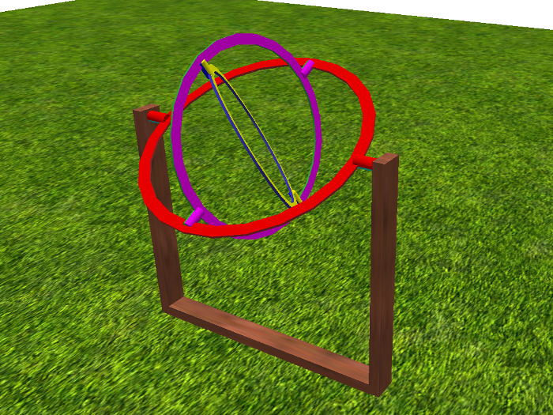
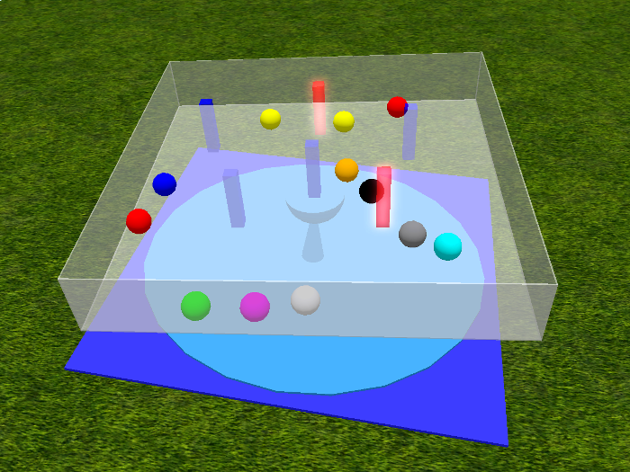
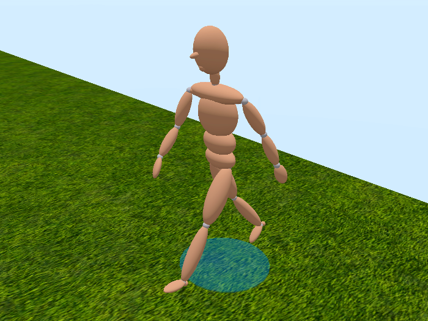
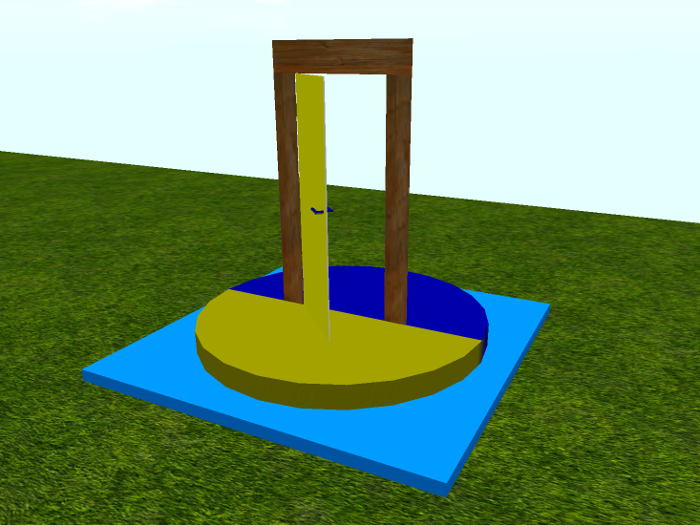

# Fourmilab Mechanisms

[Fourmilab Mechanisms](https://marketplace.secondlife.com/p/Fourmilab-Mechanisms/20515612)

This repository contains all of the software and resources,
including programs in Linden Scripting Language, textures,
notecards, and development documentation, tools, and resources
used the model and its development.  The actual model is built
within Second Life and these components are installed within it.

The
[complete package](https://marketplace.secondlife.com/p/Fourmilab-Mechanisms/20515612)
is available for free in the Second Life Marketplace.  This
repository contains everything in the model (except the prims,
which are objects built within Second Life), plus additional
resources for developers who may wish to extend or adapt the
model as they wish.  The model is delivered with "full permissions":
those who obtain it are free to copy, modify, and transfer it to
other users within Second Life.

All of this software is licensed under the Creative Commons
Attribution-ShareAlike license.  Please see LICENSE.md in this
repository for details.

## About symbolic links

Fourmilab Mechanisms is a script library containing components
which are integrated into builds which use them.  The product
is shipped with a collection of example mechanisms which use
these scripts.  Due to the structure of objects in Second Life,
each object must contain its own copy of the scripts, notecards,
and other items it uses.  To avoid confusion, and for ease of
maintenance, these common scripts are kept in the `scripts`
directory in the top level directory of this repository.  When
these scripts are included in models in subdirectories, they are
referenced by symbolic links with the models' subdirectories.
This is simply documentation that the linked script appears within
the inventory of that model.
